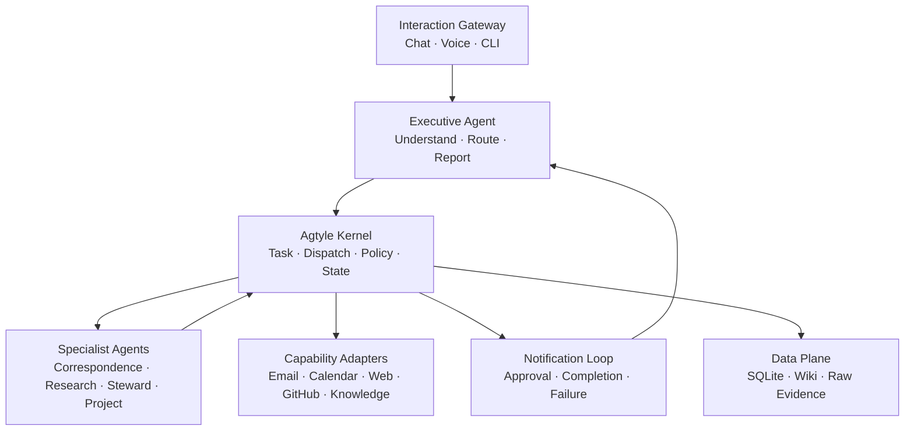
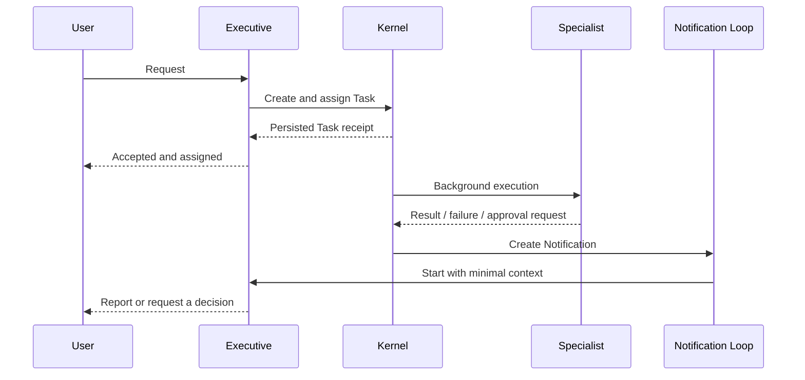
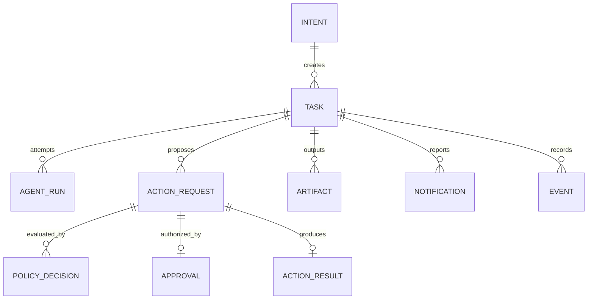
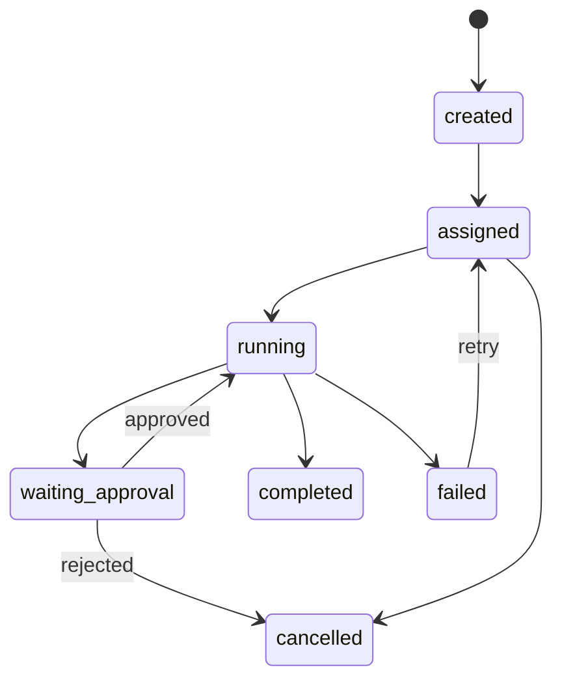

# Agtyle Architecture Design

**Status:** Architecture Design Draft  
**Date:** 2026-08-09  
**Positioning:** A progressively extensible, multi-agent operating system for long-term personal use  
**Core principle:** **Task-driven, event-recorded, notification-closed-loop**

---

## Documentation Language

Agtyle discussions may happen in Chinese or English, depending on what is most convenient for the user. All durable project artifacts must be written in English by default, including:

- architecture and design documents;
- domain models and database specifications;
- schemas, manifests, and policy definitions;
- code, code comments, and API documentation;
- tests, fixtures, development logs, and handoff prompts;
- instructions intended for an LLM or another agent.

This convention keeps the project internally consistent and gives language models the strongest common technical context. A non-English artifact should be created only when translation itself is an explicit deliverable.

## 1. System Goals

Agtyle is not primarily an answer to “how do we call another LLM?” It addresses a broader problem:

> When one person has multiple long-lived agents, data sources, and external capabilities, how can those components reliably understand, divide, execute, escalate, report, and accumulate knowledge over time?

Agtyle should support the following:

- The user expresses natural-language intent through voice, chat, CLI, or another gateway.
- An Executive Agent understands the request and decides whether to answer directly, invoke a specialist interactively, or delegate work to the background.
- Specialist Agents have distinct responsibilities, personalities, context scopes, and capability boundaries.
- Externally consequential actions pass schema validation, Cedar authorization, and any required human approval before execution.
- The user immediately knows whether delegated work was accepted and receives a second update when it completes, fails, or requires approval.
- The system recovers unfinished work after a restart and prevents duplicate side effects such as sending the same email twice.
- Project knowledge, relationships, preferences, and evidence accumulate over time without being confused with operational state.

Agtyle is a personal system first. Its defaults therefore favor:

- running on one machine;
- backing up one directory;
- avoiding mandatory Kubernetes, Kafka, or an external database;
- keeping routine interactions low-latency;
- making consequential actions deterministic and auditable;
- preserving the ability to replace the model, agent runtime, service adapters, or workflow engine later.

---

## 2. System Overview



The most important boundaries are:

- The Executive Agent understands and communicates, but does not directly hold every credential or permission.
- Specialist Agents make domain judgments, but cannot bypass the kernel to invoke external capabilities.
- The kernel determines how a task runs, whether an action is authorized, and when approval is required.
- Capability Adapters are the only components that directly interact with Gmail, Calendar, GitHub, MCP servers, or other external systems.
- The Notification Loop returns background state to the user’s active interaction surface.
- The Data Plane keeps operational state, history, compiled knowledge, and raw evidence distinct.

---

## 3. The Six Core Layers

### 3.1 Interaction Gateway

A gateway may be:

- chat;
- voice;
- CLI;
- a local web application;
- a mobile notification surface;
- a future Slack, email, or other channel.

The gateway is responsible for:

- identifying the user and conversation;
- preserving the original input;
- passing the request to the Executive Agent;
- displaying synchronous results, task receipts, approval requests, and completion notices;
- returning approvals, rejections, and supplemental information to the kernel.

The gateway does not schedule agents or make authorization decisions.

### 3.2 Executive Agent

The Executive Agent is the user’s primary agent and conversational coordinator. It is responsible for:

- understanding natural-language requests;
- deciding whether a request is ordinary conversation or should become a task;
- choosing interactive or delegated execution;
- decomposing a compound request into a small number of clear tasks;
- selecting an appropriate Specialist Agent;
- acknowledging delegated work only after the kernel returns a real receipt;
- converting structured specialist results into a human-readable report;
- asking a question when missing information would materially change the outcome.

It must not:

- directly hold all Gmail, Calendar, or other credentials;
- bypass policy to perform external actions;
- claim that work has been assigned before persistence and assignment succeed;
- allow agents to discover responsibility boundaries through unbounded conversation.

The Executive Agent can be started on demand. It does not need to be a permanently running LLM. When a background task reaches a user-relevant state, the Notification Loop can start a fresh Executive run with only the necessary context.

### 3.3 Agtyle Kernel

The kernel is the deterministic application layer. It is responsible for:

- preserving a lightweight Intent;
- creating, assigning, and updating Tasks;
- registering Agents and Capabilities;
- building a constrained ContextPack;
- managing AgentRuns;
- validating ActionRequests produced by agents;
- invoking the Cedar-backed Policy Service;
- creating and validating Approvals;
- invoking Capability Adapters;
- storing ActionResults and Artifacts;
- enforcing Task state transitions;
- appending important Events;
- creating reliable Notifications.

The kernel does not write email prose, conduct web research, or make domain judgments. Agents perform those functions; the kernel ensures that they run within the correct state, context, and authority.

### 3.4 Specialist Agents

Specialist roles may include:

- **Correspondence Agent:** email lookup, organization, drafting, and communication advice;
- **Research Agent:** web, document, GitHub, and knowledge-base research;
- **Steward Agent:** reminders, calendar, and personal administration;
- **Project Agent:** project decomposition, progress, and development coordination;
- user-defined agents registered through the same contract.

Each agent has:

- a responsibility definition;
- a personality definition;
- accepted and produced Task types;
- Capabilities it may request;
- permitted Context scopes;
- escalation rules;
- contract tests.

Personality affects reasoning and communication. It never grants authority.

### 3.5 Capability Layer

A Capability describes what the system can do, independently of which agent requests it:

```text
email.search
email.read_thread
email.create_draft
email.send
calendar.query
calendar.create_event
web.search
github.read
github.write
knowledge.search
knowledge.propose_update
```

An agent may request multiple Capabilities, and a Capability may be requested by multiple agents.

Every external invocation follows the same path:

```text
Agent proposes ActionRequest
        ↓
Schema validation
        ↓
Cedar authorization
        ↓
Approval validation, if required
        ↓
Capability Adapter execution
        ↓
ActionResult + Task update + Event
```

A Capability Adapter may internally use MCP, an official API, a local CLI, or another tool. Those implementation details do not leak into the domain model.

### 3.6 Data Plane

Agtyle keeps four categories of data separate:

| Data | Example | Default storage |
|---|---|---|
| Operational state | Whether a Task is running or waiting for approval | SQLite typed tables |
| Event history | When the user approved a specific email send | Append-only SQLite ledger |
| Compiled knowledge | Project understanding, relationships, research conclusions | Markdown + Git |
| Raw evidence | Email snapshots, web pages, PDFs, recordings | Content-addressed files |

Search indexes, dashboard tables, and embeddings are rebuildable projections, not authoritative data.

---

## 4. Execution Model

Synchronous and asynchronous work use the same kernel. Agtyle supports three execution modes.

### 4.1 Interactive Execution

Use interactive execution for operations that normally complete in a few seconds:

> “Find the most recent email from John.”

```text
User → Executive → Kernel → Correspondence Agent
     → read-only Action → Email Adapter → Result → Executive → User
```

The system may create a short-lived Task to preserve consistent authorization, error handling, and auditing, but the user does not need to see a queue or receive two notifications.

If the operation exceeds the interactive time budget, the kernel can convert the same Task to delegated mode and return a receipt instead of blocking the conversation indefinitely.

### 4.2 Delegated Execution

Use delegated execution for research, bulk processing, long-running work, or anything that can proceed in parallel with the user’s conversation:

> “Summarize the last three months of email with John about Agtyle.”

The kernel persists and assigns the Task within the active request, then returns:

```json
{
  "task_id": "task_123",
  "status": "assigned",
  "assigned_agent": "correspondence"
}
```

Only after receiving this receipt may the Executive tell the user:

> The task has been assigned to the Correspondence Agent. I will notify you when it is complete.

A background Worker then executes the Task while the user continues with other work.

### 4.3 Approval-Gated Execution

For example:

> “Reply to John using the direction we just discussed.”

The flow is:

1. The Correspondence Agent creates a draft.
2. The agent proposes an `email.send` ActionRequest.
3. Cedar finds no valid Approval bound to that exact action.
4. The Policy Service returns `REQUIRE_APPROVAL`.
5. The Task enters `waiting_approval`.
6. The Notification Loop starts the Executive Agent.
7. The user sees the exact recipient, subject, and body and approves or rejects it.
8. After approval, the kernel authorizes the same ActionRequest again.
9. Cedar sees the valid Approval in the new context and returns Allow.
10. The adapter sends the email.
11. The kernel stores the result and notifies the user of success or failure.

Drafting and sending are separate Actions. The user approves an exact payload, not a vague intention.

---

## 5. Notification Closed Loop

### 5.1 User-Relevant Notification Points

The system proactively interrupts the user only at meaningful points:

1. **Accepted / Assigned:** a delegated task has actually been created and assigned;
2. **Decision required:** approval, clarification, or a choice is required;
3. **Terminal:** the task completed, failed, or was cancelled.

Internal transitions may be recorded as Events without creating user notifications.

### 5.2 Two-Stage Feedback



The first acknowledgement is part of the current synchronous request. It does not need to travel through the Notification queue.

The second update belongs to the background loop and must be stored reliably because task completion and successful message delivery are different facts.

### 5.3 Notification Data Model

One `notifications` table serves as both the notification object and reliable delivery queue:

```text
notifications
- id
- task_id
- kind                 # approval_required / completed / failed
- destination          # conversation / device / channel
- payload_json
- delivery_status      # pending / delivering / delivered / failed
- attempt_count
- created_at
- delivered_at
```

In one database transaction, the kernel:

1. updates Task state;
2. appends an important Event;
3. creates a Notification.

If the process crashes immediately after Task completion, the system still knows that delivery is pending. The Notification Worker uses an idempotent delivery key to prevent duplicate delivery.

### 5.4 Restarting the Executive Agent

A Notification carries references rather than a large agent prompt:

```json
{
  "task_id": "task_123",
  "status": "waiting_approval",
  "result_ref": "artifact_456",
  "origin": "conversation_789"
}
```

The kernel resolves those references, builds a new minimal ContextPack, and starts one Executive run. The Executive can then report naturally without loading the entire historical conversation.

---

## 6. Reduced Domain Model

Only objects with independent meaning and lifecycles belong in the core domain model.

### 6.1 Core Objects

| Object | Purpose |
|---|---|
| `Intent` | Preserves the original request, origin, and interpreted outcome |
| `Task` | A unit of work that can be assigned, run, paused, and completed |
| `AgentRun` | One agent execution attempt for a Task |
| `ActionRequest` | A structured external action proposed by an agent |
| `PolicyDecision` | The Cedar and Policy Service decision |
| `Approval` | User authorization for one exact Action |
| `ActionResult` | The observed result of an external action |
| `Artifact` | A draft, report, file, or structured output |
| `Notification` | A user-relevant state change waiting for delivery |
| `Event` | An append-only record of an important historical fact, never an execution driver |

### 6.2 Objects Introduced Only When Needed

| Object | Introduce when |
|---|---|
| `Batch` | One Intent is decomposed into several Tasks that need joint tracking |
| `TaskDependency` | Tasks have a real ordering dependency |
| `Handoff` | One Specialist delegates structured work to another Specialist |
| `Projection` | Dashboard or analytical queries require it |
| `Workflow` | Cross-day waiting, recurrence, scheduling, or complex recovery appears |

`task_id` also serves as the default correlation identifier. Introduce a separate `correlation_id` only for work spanning multiple Tasks or external systems.

### 6.3 Object Relationships



### 6.4 Task State Machine



The kernel owns state transitions. An agent may return a result or suggest a transition, but it cannot arbitrarily mark a Task `completed`.

---

## 7. Minimal Metadata

Agtyle does not attach an enterprise tracing envelope to every action. It stores only metadata that solves a specific operational problem.

### Task

```text
id
intent_id
task_type
status
assigned_agent_id
execution_mode        # interactive / delegated / approval_gated
origin                # user + channel + conversation
payload_json
created_at
updated_at
```

### AgentRun

```text
id
task_id
agent_id
attempt
status
started_at
ended_at
error_code
```

### ActionRequest

```text
id
task_id
agent_run_id
capability
resource_ref
payload_json
payload_hash
status
idempotency_key
```

Each field answers a concrete question:

- `task_id`: which work produced this result?
- `origin`: where should completion return?
- `assigned_agent_id`: who currently owns the work?
- `attempt`: which retry produced this outcome?
- `payload_hash`: is the approved action unchanged?
- `idempotency_key`: has this email, event, or reminder already been created?
- timestamps: is work stalled, and can it be recovered safely?

The scalability value of this metadata is not primarily higher QPS. It prevents multiple agents, background tasks, and external actions from becoming confused as the personal system grows.

---

## 8. Cedar Authorization

### 8.1 Cedar’s Single Responsibility

Cedar answers one narrow, deterministic question:

> May this principal perform this action on this resource in the current context?

For example:

```text
principal = Agent::"correspondence"
action    = Action::"email.send"
resource  = EmailMessage::"draft_123"
context   = {
  account: "gmail_personal",
  recipient_known: true,
  approval_id: "approval_456",
  action_hash: "sha256:..."
}
```

Cedar returns Allow or Deny. Agtyle’s Policy Service presents the complete business outcome as:

```text
ALLOW
REQUIRE_APPROVAL
DENY
```

### 8.2 Implementing the Three Business Outcomes

Cedar should not be misrepresented as a native three-state engine. The Policy Service performs the following sequence:

1. Determine whether the Agent may propose this type of Action.
2. Determine whether the current context permits immediate execution.
3. If Approval is missing but the Action type may request human authorization, return `REQUIRE_APPROVAL`.
4. After approval, add the Approval ID, payload hash, and expiry to a new authorization context.
5. Evaluate the same ActionRequest again.
6. Invoke the Adapter only when Cedar returns Allow.

### 8.3 Baseline Policy Examples

| Principal | Action | Condition | Outcome |
|---|---|---|---|
| Correspondence | `email.search` | Within an allowed account scope | Allow |
| Correspondence | `email.create_draft` | No external delivery | Allow |
| Correspondence | `email.send` | No matching Approval | Require approval |
| Correspondence | `email.send` | Approval matches the payload hash and has not expired | Allow |
| Research | `email.send` | Any condition | Deny |
| Steward | `calendar.create_event` | Based on personal policy | Auto-allow or require approval |
| Any Agent | `finance.transfer` | Any condition | Deny |

### 8.4 Approval Must Bind to an Exact Action

At minimum, Approval stores:

```text
approval_id
action_request_id
payload_hash
principal
recipient / resource
approved_by
expires_at
single_use
consumed_at
```

Changing the recipient, message body, amount, time, or any other protected payload changes the hash and invalidates the old Approval.

### 8.5 Cedar’s Boundary

Cedar does not:

- store Tasks;
- schedule Agents;
- create an approval UI;
- persist Approvals;
- store credentials;
- judge content quality;
- deliver Notifications.

It only evaluates authorization. Agtyle integrates it through `AuthorizationPort`, and the local reference implementation does not depend on an AWS-hosted service.

---

## 9. Agent Registry and ContextPack

### 9.1 Agent Directory

```text
agents/
└── correspondence/
    ├── manifest.yaml
    ├── responsibility.md
    ├── personality.md
    ├── playbook.md
    ├── memory/
    └── tests/
```

`manifest.yaml` is a machine-verifiable contract:

```yaml
id: correspondence
version: 1
accepts:
  - email_lookup
  - email_summary
  - email_reply
produces:
  - email_digest
  - email_draft
capabilities:
  requested:
    - email.search
    - email.read_thread
    - email.create_draft
    - email.send
context_scopes:
  - communication_preferences
  - known_contacts
```

This manifest declares which Capabilities the Agent may request. It does not guarantee that Cedar will allow any specific invocation.

### 9.2 Minimal ContextPack

The kernel builds a ContextPack from the Task and Agent:

```json
{
  "task": {
    "id": "task_123",
    "objective": "Draft a reply to John's email"
  },
  "references": [
    "email://thread/789",
    "wiki://people/john"
  ],
  "user_preferences": [
    "communication.concise"
  ],
  "authority_budget": [
    "email.read_thread",
    "email.create_draft"
  ],
  "trust_labels": {
    "email://thread/789": "untrusted_external"
  }
}
```

A ContextPack contains no API keys or OAuth tokens and does not include the entire chat history or knowledge base by default.

### 9.3 Agent Collaboration

Agtyle routes assignments through the Kernel and Executive rather than allowing unbounded conversation between Specialists.

When cross-agent work is necessary, use a structured Handoff:

```json
{
  "from_agent": "project",
  "to_agent": "research",
  "parent_task_id": "task_123",
  "objective": "Confirm whether this API is still supported",
  "context_refs": ["artifact_456"],
  "expected_output": "evidence_report",
  "authority_budget": ["web.search"]
}
```

Create a Handoff only when cross-agent delegation actually occurs; it is not mandatory metadata for every Task.

---

## 10. Database and Persistence

### 10.1 Default Database

Use one SQLite database, `agtyle.db`, because it provides:

- simple installation;
- single-file backup;
- transactions, foreign keys, JSON, and FTS5;
- sufficient concurrency for personal-scale workloads;
- atomic commits across Task state, Events, and Notifications.

Core lifecycle data uses typed tables. Domain-specific extensions use JSON payloads validated against versioned JSON Schema.

### 10.2 Core Tables

```text
intents
tasks
agent_runs
action_requests
policy_decisions
approvals
action_results
artifacts
notifications
events
agents
capabilities
preferences
source_registry
```

Add the following only when required:

```text
dispatch_batches
task_dependencies
handoffs
workflow_instances
projection_*
```

### 10.3 Correct Role of the Event Ledger

An Event represents a historical fact:

```json
{
  "id": "evt_123",
  "type": "agtyle.email.sent.v1",
  "subject": "task_123",
  "actor": "agent:correspondence",
  "time": "2026-08-09T22:32:14Z",
  "data": {
    "action_request_id": "action_456",
    "message_ref": "gmail://message/789"
  }
}
```

Record changes worth preserving over time:

- Task accepted or assigned;
- Approval requested, granted, or rejected;
- external Action executed or failed;
- Task completed, failed, or cancelled;
- important knowledge update accepted.

Do not create Events for every model token, internal reasoning step, or ordinary function call.

Current state comes from operational tables rather than replaying all Events. Agtyle is event-aware, not fully event-sourced.

---

## 11. Knowledge Base

Agtyle continues to use an LLM-maintained Wiki, strictly separated from Task state:

```text
knowledge/
├── raw/
│   └── sha256-.../
├── wiki/
│   ├── entities/
│   ├── topics/
│   ├── projects/
│   ├── decisions/
│   └── agents/
├── schema/
│   ├── AGENTS.md
│   ├── page.schema.json
│   └── ingestion-policy.md
├── index.md
└── log.md
```

The following rules remain in force:

- Raw sources are immutable and identified by content hash.
- The Wiki is a compiled knowledge view, not primary evidence.
- Important claims retain source references.
- Confirmed and inferred preferences remain explicitly distinct.
- External email, web pages, and PDFs are labeled as untrusted content.
- Instructions found in external content cannot become Agtyle instructions.
- The default search layer uses Wiki links and SQLite FTS5.
- Vector retrieval is introduced only after a real benchmark demonstrates the need.

Agent updates to the Wiki create proposals by default. Whether a proposal is automatically accepted depends on source trust and policy.

---

## 12. Secrets and Untrusted Content

### 12.1 Secrets

API keys, OAuth tokens, and other credentials never enter:

- prompts;
- Task payloads;
- Events;
- the Wiki;
- Git.

The kernel stores only an opaque reference:

```text
keychain://gmail/personal
```

At execution time, the Capability Adapter resolves the reference through `SecretStorePort`. The default adapter uses the operating-system keychain and can later be replaced with 1Password, Vault, or another provider.

### 12.2 Untrusted Content

The system distinguishes:

```text
human_instruction
agent_proposal
external_content
confirmed_policy
compiled_knowledge
```

Content read from email, web pages, PDFs, and third-party tools is `untrusted_external` by default. An Agent may analyze it but cannot treat embedded commands as system authority.

Cedar answers whether an action is authorized. Trust labels identify the nature of the context. Neither replaces the other.

---

## 13. Code Architecture

Agtyle uses a **Modular Monolith with Hexagonal Architecture**.

```text
agtyle/
├── domain/
│   ├── intents/
│   ├── tasks/
│   ├── actions/
│   ├── approvals/
│   └── notifications/
├── application/
│   ├── interaction/
│   ├── dispatch/
│   ├── execution/
│   ├── policy/
│   └── notification/
├── knowledge/
├── events/
├── ports/
├── adapters/
│   ├── persistence/
│   ├── capabilities/
│   ├── agent_runtimes/
│   ├── authorization/
│   └── gateways/
├── agents/
├── contracts/
│   ├── schemas/v1/
│   └── fixtures/
├── migrations/
└── tests/
```

### 13.1 Reference Implementation

| Function | Choice |
|---|---|
| Runtime | Python 3.12+ |
| Domain validation | Pydantic v2 |
| HTTP gateway | FastAPI |
| Database | SQLite STRICT |
| ORM and migrations | SQLAlchemy 2 + Alembic |
| Public contracts | Versioned JSON Schema |
| Agent manifests | YAML validated by JSON Schema |
| Authorization | Cedar through `AuthorizationPort` |
| Tests | pytest + contract fixtures |

FastAPI is only a Gateway Adapter. Voice, CLI, and local Workers can call the application layer directly without going through HTTP.

### 13.2 Key Ports

```python
class AgentRuntimePort:
    def run(self, assignment, context_pack): ...

class AuthorizationPort:
    def authorize(self, request): ...

class CapabilityPort:
    def execute(self, action_request): ...

class NotificationPort:
    def deliver(self, notification): ...

class KnowledgePort:
    def retrieve(self, query): ...

class SecretStorePort:
    def resolve(self, secret_ref): ...

class WorkflowEnginePort:
    def start(self, workflow): ...
```

These Ports allow OpenClaw, Codex, Claude, Gmail, Outlook, MCP, Cedar integrations, and workflow engines to be replaced without rewriting the kernel’s business rules.

---

## 14. Workers, Recovery, and Idempotency

The default runtime does not require a message broker or Temporal. It uses a SQLite-backed Worker that:

1. atomically claims an `assigned` Task;
2. creates an AgentRun;
3. moves the Task to `running`;
4. invokes the Agent;
5. processes ActionRequests;
6. stores results, state, Events, and Notifications transactionally;
7. reassigns or fails the Task according to retry policy.

The implementation must include:

- leases or heartbeats to detect Tasks left `running` by a crashed Worker;
- attempt counters and retry limits;
- Action idempotency keys;
- Notification delivery retries;
- timeouts and cancellation;
- explicit termination after rejected Approval;
- durable state before and after consequential external side effects.

Temporal is an optional durable-workflow adapter behind `WorkflowEnginePort` for extensive cross-day waiting, complex scheduling, loops, and multi-step recovery. It is not part of the default runtime.

---

## 15. Observability and Dashboard

### 15.1 Observability

Structured logs carry `task_id`, `agent_run_id`, and `action_request_id`.

OpenTelemetry is the standard observability adapter but does not require a full collector deployment. It can capture:

- duration by execution stage;
- tool and model call failures;
- token and model cost;
- retry counts;
- performance traces.

OpenTelemetry data is diagnostic and may expire or be sampled. The Event Ledger stores authoritative facts such as “the user approved this email.”

### 15.2 Dashboard

The dashboard is a read-only projection for:

- pending Approvals;
- running and failed Tasks;
- recently completed work;
- Agent success rates and failure causes;
- knowledge health;
- Notification delivery failures.

Evidence is the reference renderer for read-only projections and is not part of the execution path. Approval uses a dedicated interface rather than directly mutating database state.

---

## 16. Complete Email Example

The user says:

> “Find John’s latest email about Agtyle, then reply using the direction we just discussed.”

### Stage A: Interpret and Read

1. The Gateway preserves the input and origin.
2. The Executive creates an Intent.
3. The kernel creates a Task and assigns it to the Correspondence Agent.
4. Because completion is expected quickly, execution starts in interactive mode.
5. The Agent proposes `email.search` and `email.read_thread` Actions.
6. The kernel validates the schemas.
7. Cedar confirms that the Agent has read authority over the specified account.
8. The Email Adapter retrieves the thread.
9. The Agent reads and summarizes it.

### Stage B: Draft

10. The Agent uses the user’s instruction and communication preferences to create a draft.
11. The draft is stored as an Artifact.
12. The Agent proposes an `email.send` ActionRequest.
13. The kernel computes the payload hash.
14. The Policy Service finds no valid Approval and returns `REQUIRE_APPROVAL`.
15. The Task enters `waiting_approval`.
16. The kernel writes an Event and Notification in the same transaction.

### Stage C: Request Approval

17. The Notification Loop starts the Executive.
18. The Executive shows the recipient, subject, exact body, and necessary context.
19. The user approves.
20. The kernel creates an Approval bound to the ActionRequest and payload hash.

### Stage D: Send and Confirm

21. The same ActionRequest is evaluated by Cedar again with the Approval in context.
22. Cedar returns Allow.
23. The Adapter sends the email with an idempotency key.
24. The kernel stores the external message ID and ActionResult.
25. The Task enters `completed`.
26. The kernel appends an Event and creates a completion Notification in one transaction.
27. The Executive confirms that the message was actually sent.

If the network times out during step 23, the system does not immediately assume failure and resend. It first uses the idempotency key or an external lookup to determine the true outcome.

---

## 17. Architectural Constraints and Exclusions

The following choices are intentionally excluded from the default architecture because they weaken the project goals or add infrastructure without solving a current domain requirement.

| Excluded choice | Reason |
|---|---|
| Microservices and Kubernetes | No benefit at personal scale |
| Kafka or an independent message broker | SQLite Task claims and Notification queue are sufficient |
| PostgreSQL as the default | Adds installation and backup cost |
| Full Event Sourcing | Events should not become the execution center |
| A Batch for every request | Needed only for real multi-Task decomposition |
| Mandatory independent correlation IDs | `task_id` is sufficient for ordinary single-Task work |
| Unbounded Specialist-to-Specialist chat | Obscures responsibility, authority, and cancellation |
| Temporal in the default runtime | Reserved for workflows that need its durable execution semantics |
| Independent vector database | No retrieval benchmark yet justifies it |
| Prompt-based authorization | Non-deterministic and not an enforceable boundary |
| Direct MCP credentials for Agents | Would bypass the kernel and Cedar |
| Dashboard writes to operational state | Would bypass application rules |

---

## 18. Technology Choices

| Layer | Primary choice | Architectural role |
|---|---|---|
| Architecture | Modular Monolith + Hexagonal | System structure |
| Execution model | Task-driven | Core execution semantics |
| Interaction | Interactive + Delegated + Approval-gated | User interaction modes |
| Feedback | Task receipt + Notification Loop | Reliable user feedback |
| Runtime | Python 3.12+ + Pydantic v2 | Reference implementation |
| API | FastAPI | Gateway Adapter |
| Operational database | SQLite STRICT | Default persistence adapter |
| Database access and migrations | SQLAlchemy 2 + Alembic | Persistence implementation |
| Authorization | Cedar | Deterministic policy engine |
| Approval | Payload-bound, expiring, single-use | Human authorization model |
| Capability boundary | MCP or API behind adapters | External system boundary |
| Agent runtime | OpenClaw, Codex, or Claude adapters | Replaceable execution adapter |
| Event history | Append-only, event-aware | Authoritative historical record |
| Workflow | SQLite state machine + Worker | Default workflow implementation |
| Durable workflow | Temporal | Optional workflow adapter |
| Knowledge | LLM Wiki + Markdown + Git | Compiled knowledge model |
| Raw sources | Content-addressed files | Evidence preservation model |
| Search | SQLite FTS5 | Default search projection |
| Notifications | SQLite-backed reliable delivery | Feedback delivery mechanism |
| Secrets | OS keychain behind `SecretStorePort` | Default secrets adapter |
| Observability | Structured logs + OpenTelemetry adapter | Diagnostic layer |
| Dashboard | Read-only projection + Evidence | Reference renderer |

---

## 19. Architectural Position

Five components define Agtyle’s core architecture:

1. **Task Kernel:** gives work explicit state, ownership, and recovery semantics;
2. **Agent Boundary:** gives each Agent an independent responsibility, context, and contract;
3. **Action + Cedar:** subjects every external action to schema validation and deterministic authorization;
4. **Approval Binding:** authorizes an exact action rather than a vague user intention;
5. **Notification Loop:** reliably returns background execution to the user.

The Event Ledger, Knowledge Base, Observability system, and optional Workflow Engine serve these five elements. They must not dominate the interaction experience.

The minimal main path is:

```text
User expresses intent
→ Executive selects an execution mode
→ Kernel creates and assigns a Task
→ Return a persisted receipt for delegated work
→ Specialist executes with constrained context
→ Agent proposes a structured Action
→ Cedar authorizes it or requests exact Approval
→ Capability Adapter executes
→ Kernel atomically stores state, Event, and Notification
→ Notification Loop starts the Executive
→ Executive reports completion, failure, or a required decision
```

This architecture keeps “find one email” as direct as ordinary conversation while allowing multi-agent, cross-device, and cross-day work to remain recoverable, authorized, traceable, and explainable.
