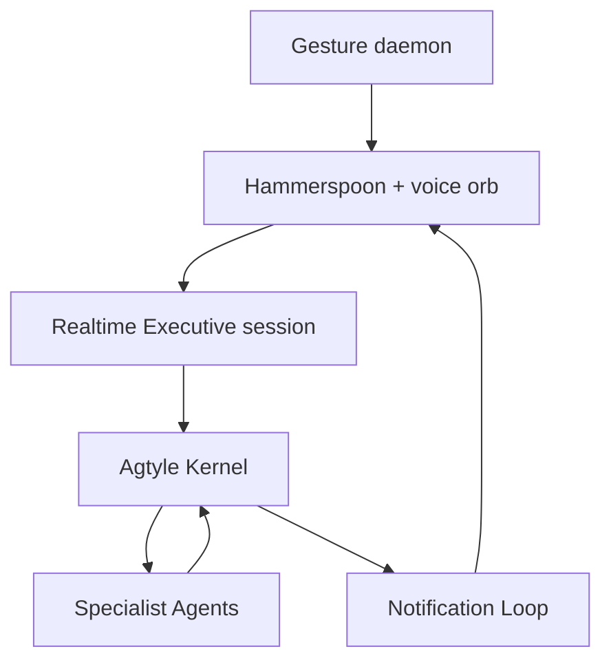

# Agtyle Voice Entry Integration

## 1. Purpose

This document defines the hands-free voice and gesture entry interface for Agtyle.

The interface gives the user a low-latency way to summon the Executive Agent, express one or more intentions naturally, receive immediate acknowledgement for accepted work, continue speaking while delegated work runs, and receive reliable completion, failure, reminder, or approval notifications.

The interface is an Agtyle Interaction Gateway. It does not create an independent task system, permission system, worker registry, or source of execution truth.

The central responsibility boundary is:

> The voice layer listens, converses, clarifies, and proposes. The Agtyle Kernel persists, validates, authorizes, executes, recovers, and notifies.

## 2. Product Experience

The intended interaction is:

1. The user performs one quick gesture.
2. A non-activating voice orb appears without changing application focus.
3. The existing microphone and Realtime session become available immediately.
4. The user speaks naturally and may interrupt the Executive Agent while it is speaking.
5. The Executive Agent either answers directly, asks one material clarifying question, or proposes durable work.
6. For delegated work, the Executive Agent confirms assignment only after the Kernel returns a committed Task receipt.
7. The voice conversation remains responsive while Specialist Agents work in the background.
8. When work completes, fails, or requires a decision, the Notification Loop returns the result to the originating voice conversation or its configured fallback surface.
9. The same gesture dismisses the orb.

The gesture is a reversible summon/dismiss action. It is not a navigation language.

## 3. Architectural Position

The voice entry interface implements the `Interaction Gateway` role defined by Agtyle. Its components are adapters around the Agtyle application layer.



### 3.1 Executive identity

The named voice persona, initially `Yukie`, is the voice embodiment of the user's Executive Agent. It is not a separate assistant that dispatches work to another hidden Executive Agent.

Personality controls speaking style, pacing, warmth, and brevity. Personality does not grant authority.

### 3.2 Separation of responsive conversation and durable work

The Realtime session stays responsive. Long-running work never blocks the audio session. A durable Task is created and assigned, a receipt is returned, and the worker path proceeds independently.

The user may continue speaking and create additional intentions while prior Tasks are running.

### 3.3 Single source of task truth

Agtyle Tasks are the only durable work records. Realtime function calls, Hammerspoon events, local session objects, and worker runtime sessions must never become competing task stores.

## 4. Component Responsibilities

| Component | Responsibilities | Explicitly forbidden |
|---|---|---|
| Gesture daemon | Detect an armed snap or pinch-release and emit a local summon event | Creating Intents, Tasks, or Actions |
| Hammerspoon integration | Global hotkeys, URL events, orb lifecycle, native macOS notification fallback | Routing work or deciding authorization |
| WKWebView orb | WebRTC media, visual state, local playback, barge-in presentation | Holding permanent API credentials |
| Realtime session adapter | Session configuration, voice persona, turn-taking, function-call transport | Calling Capability Adapters directly |
| Realtime Executive | Understand requests, clarify ambiguity, produce validated Executive decisions, report receipts and results | Claiming assignment before receipt; bypassing the Kernel |
| Voice gateway controller | Bind trusted user/session identity, capture turn identifiers, validate tool arguments, invoke application services | Inventing domain decisions or storing a second task queue |
| Agtyle Kernel | Persist Intent and Tasks, validate proposals, create receipts, enforce state and idempotency | Producing conversational prose or holding audio sessions |
| Notification adapter | Deliver a stored Notification to an active voice session or configured macOS fallback | Marking work complete without a durable Notification |

## 5. Reusable Prototype Components

The following prototype components should be imported with minimal behavioral change:

- MediaPipe Gesture Recognizer and the custom snap/pinch-release state machine;
- OpenCV camera daemon and armed/unarmed lifecycle;
- Hammerspoon URL event routing;
- non-activating WKWebView orb;
- visibility-gated Escape handling;
- global keyboard fallback;
- WebRTC microphone and audio playback;
- warm microphone/session management;
- semantic voice activity detection and interruption behavior;
- the Whisper-to-text-to-TTS degraded path;
- Yukie's concise, warm, fast persona.

The following prototype responsibilities must be refactored:

- direct worker-session dispatch;
- the local server's independent worker fleet truth;
- four-second polling as the primary completion mechanism;
- direct `search_kb`, `check_tasks`, and `note` writes that bypass Agtyle Tasks and policy;
- client-owned business logic for Realtime function tools.

## 6. OpenAI Realtime Integration

The first adapter uses `gpt-realtime-2.1` through the generally available Realtime API. Browser media uses WebRTC. The implementation uses:

- `POST /v1/realtime/client_secrets` for short-lived client credentials;
- `POST /v1/realtime/calls` for WebRTC session establishment;
- an `oai-events` data channel for client lifecycle events;
- `semantic_vad` with `interrupt_response: true`;
- low reasoning effort as the initial latency-oriented default;
- a privacy-preserving `OpenAI-Safety-Identifier` supplied by the trusted local server.

The permanent OpenAI API key must remain on the local server.

Official references:

- [Realtime and audio](https://developers.openai.com/api/docs/guides/realtime)
- [Realtime API with WebRTC](https://developers.openai.com/api/docs/guides/realtime-webrtc)
- [Realtime conversations](https://developers.openai.com/api/docs/guides/realtime-conversations)
- [Realtime with tools](https://developers.openai.com/api/docs/guides/realtime-mcp)
- [Server-side controls](https://developers.openai.com/api/docs/guides/realtime-server-controls)
- [Voice activity detection](https://developers.openai.com/api/docs/guides/realtime-vad)

### 6.1 Server-side sideband control

Tool configuration and execution belong on the trusted local server. After the WebRTC call is created, the server opens a sideband WebSocket to the same Realtime session using its call identifier.

The sideband connection is responsible for:

- installing and updating Executive tool definitions;
- receiving function calls;
- validating arguments against Agtyle contracts;
- invoking Agtyle application services;
- returning function-call results;
- injecting stored Notifications into an active session;
- monitoring session lifecycle and reconnecting safely.

The browser data channel may display lifecycle information, but it must not own capability execution or authorization logic.

### 6.2 Session duration and renewal

Realtime sessions are replaceable presentation sessions, not durable conversations. The Voice Session Registry tracks the current session, and a renewed session receives only the minimal context required to continue.

Task and Notification continuity must not depend on a Realtime session remaining connected.

## 7. Executive Decision Contract

The Realtime Executive must produce one structured decision for each material user turn:

```text
DirectResponse
TaskProposal
ClarificationResponse
```

The voice gateway exposes one principal function tool:

```text
commit_interaction_decision(turn_id, decision)
```

Trusted values are supplied by the gateway and are not accepted from model arguments:

- `user_id`;
- `conversation_id`;
- origin channel;
- Realtime call identifier;
- original turn transcript;
- idempotency key;
- receipt timestamps and identifiers.

The model supplies only the untrusted decision.

### 7.1 Task proposal example

```json
{
  "turn_id": "turn_01",
  "decision": {
    "kind": "task_proposal",
    "task_type": "reminder_create",
    "assigned_agent_id": "steward",
    "execution_mode": "delegated",
    "objective": "Create a reminder",
    "payload": {
      "title": "stretch",
      "scheduled_for": "2026-08-16T18:30:00-06:00",
      "timezone": "America/Denver"
    }
  }
}
```

The Kernel validates the Agent, Task type, payload schema, execution mode, and responsibility boundary before persistence.

### 7.2 Receipt rule

The Realtime Executive must not say that work was created, assigned, scheduled, sent, or completed until the corresponding application service returns a committed result.

Acceptable pre-receipt language is limited to a short process preamble such as:

> One moment.

After a receipt:

> I assigned that reminder to the Steward Agent. I will let you know when it is ready.

### 7.3 Invalid output

Malformed or unsupported tool arguments are rejected as untrusted Agent output. The controller may return one structured correction request to the Realtime model. A second invalid result ends the turn with a specific clarification or safe failure message. No Task or Capability invocation occurs.

### 7.4 Multiple intentions

The architecture must allow one human utterance to produce multiple Task proposals associated with one Intent. The first acceptance slice exercises one reminder only, but implementation choices must not make the one-Task limitation permanent.

When multiple Tasks are proposed, the Kernel must validate all proposals before atomically committing the plan or explicitly return which proposal requires clarification. Partial silent dispatch is forbidden.

## 8. Application-Layer Integration

The current interaction path should be separated into decision production and deterministic decision commitment:

```text
handle_interaction(command)
  -> Executive runtime produces decision
  -> commit_interaction_decision(command, decision)
```

Text and CLI gateways may continue using the combined method. The Realtime gateway calls the deterministic commitment method after the Realtime Executive produces its decision.

The commitment method must:

1. check interaction idempotency;
2. preserve the original user turn;
3. validate the Executive decision as untrusted input;
4. persist an Intent;
5. create and assign any Tasks atomically;
6. append important Events;
7. commit;
8. return a receipt derived from committed state.

The Realtime gateway must never import or call a Capability Adapter.

## 9. Voice Session Registry

The Voice Session Registry is transient operational state. It may be in memory with restart reconstruction from active connections.

Each record contains:

```text
conversation_id
user_id
realtime_call_id
state                  # connecting / active / muted / dismissed / closed
orb_visible
last_activity_at
sideband_connected
notification_policy
```

It must not contain permanent credentials, a duplicate task status, or an independent work queue.

The Realtime call identifier and raw model events should be retained only as long as required for operation and debugging under the configured retention policy.

## 10. Notification Integration

Voice entry requires channel-aware Notification routing. A single globally selected notification adapter is insufficient when CLI, voice, and future chat gateways coexist.

Introduce a deterministic destination resolver:

```text
origin channel + user preference + notification kind
  -> NotificationDestination
```

The stored destination includes at least:

```text
channel
adapter
user_id
conversation_id
```

### 10.1 Active voice session

When the originating voice session is active, the Voice Notification Adapter:

1. deduplicates using `delivery_key`;
2. injects the stored Notification facts through the server-side connection;
3. asks the Executive to render a concise spoken update;
4. receives a presentation acknowledgement;
5. returns delivery success to the Notification Worker.

The Executive may summarize stored facts but must not change identifiers, approval payloads, recipients, times, or outcomes.

### 10.2 Inactive voice session

When the orb is inactive, the adapter uses a native macOS notification. Notification policy determines whether a reminder or approval request may also summon the orb.

Default policy:

- Task completion: native notification; do not open the microphone.
- Task failure: native notification; summarize on next summon.
- Approval required: prominent native notification; do not approve automatically.
- Reminder due: native notification and optional spoken interruption if the user enabled it.

No Notification may be lost merely because the Realtime session ended.

### 10.3 Delivery semantics

Task completion and Notification delivery remain separate facts. Delivery is at-least-once at the adapter boundary and must be externally idempotent by `delivery_key`.

The same delivery key must never produce duplicate speech, duplicate native notifications, or duplicate approval prompts.

## 11. Gesture and Device Rules

The gesture subsystem remains outside the Agtyle domain model.

Required behavior:

- one armed snap toggles the orb;
- the same gesture dismisses it;
- the gesture does not create an Intent;
- the camera is off unless explicitly armed;
- arming and disarming are available through a global hotkey;
- accidental repeated detections are debounced;
- an unavailable camera does not prevent keyboard or voice entry;
- Escape closes the orb only when the orb is visible;
- no gesture may approve a consequential Action.

## 12. Audio Fallback

If WebRTC cannot be established, the gateway uses:

```text
recorded audio
-> transcription
-> the same Executive decision contract
-> the same Agtyle application path
-> text response
-> TTS playback
```

The fallback is a transport degradation, not an authorization or execution fallback. It must not bypass Task persistence, Cedar, approvals, or Notifications.

If OpenAI audio services are unavailable entirely, the system should preserve the captured request locally only when the user has opted into deferred transcription. Otherwise it fails visibly and does not claim the request was accepted.

## 13. Privacy and Security

- Permanent provider keys remain in the trusted local server or configured Secret Store.
- Short-lived Realtime credentials are scoped to one session.
- Raw audio is not persisted by default.
- The user transcript is retained only when it becomes an Agtyle Intent or the user explicitly enables conversation history.
- External text returned by tools is untrusted context and cannot modify Executive or Kernel instructions.
- The Realtime model cannot choose `user_id`, authority, approval state, policy outcome, Task identifiers, or idempotency keys.
- All consequential Actions continue through ActionRequest validation and Cedar.
- Gesture events are local-only and carry no credentials.
- Logs redact tokens, authorization headers, raw audio, and secret values.
- Session and notification endpoints bind to `127.0.0.1` by default.

## 14. Initial Vertical Slice

The first implementation proves this path:

```text
snap
-> orb visible
-> Realtime session active
-> "Remind me to stretch in two minutes"
-> validated Executive TaskProposal
-> persisted Intent and assigned Task
-> spoken receipt confirmation
-> Steward Agent execution
-> Cedar authorization
-> Reminder creation
-> completion Notification
-> due Notification delivered exactly once
```

The interface remains available after the Task receipt so the user can continue speaking while the reminder is processed.

## 15. Implementation Work Packages

### WP-VE-01 — Import and isolate the entry prototype

- Add the gesture daemon, Hammerspoon integration, orb assets, and local setup scripts.
- Preserve prototype behavior in isolated gateway/adapter directories.
- Document macOS permissions for camera, microphone, notifications, and URL handlers.
- Prove summon/dismiss behavior without starting the Agtyle Worker.

### WP-VE-02 — Realtime session adapter

- Implement ephemeral credential creation and WebRTC call establishment.
- Add the server-side sideband controller.
- Configure `gpt-realtime-2.1`, voice, persona, VAD, interruption, and tool definitions.
- Implement session lifecycle, renewal, reconnect, and explicit failure states.

### WP-VE-03 — Executive decision commitment

- Split model decision production from deterministic commitment.
- Add the versioned tool schema.
- Derive idempotency from trusted session and turn identifiers.
- Validate DirectResponse, ClarificationResponse, and TaskProposal.
- Ensure acknowledgement follows persistence.

### WP-VE-04 — Channel-aware notifications

- Add the destination resolver.
- Implement the Voice Notification Adapter.
- Add active-session speech delivery and inactive-session macOS delivery.
- Enforce delivery-key deduplication.

### WP-VE-05 — Deterministic verification harness

- Add fake gesture, Realtime, sideband, microphone, audio, and macOS notification adapters.
- Exercise the complete reminder path without network, camera, microphone, or wall-clock sleeps.
- Add crash, retry, duplicate-call, and session-disconnect scenarios.

### WP-VE-06 — Live macOS smoke test

- Exercise real MediaPipe detection, Hammerspoon, WKWebView, WebRTC, microphone, speaker, Task Worker, Scheduler, and Notification Worker.
- Capture a machine-readable verification report and a short human checklist.

## 16. Verification Requirements

### 16.1 Deterministic tests

The automated suite must prove:

1. A gesture event changes only gateway state.
2. A repeated gesture event inside the debounce interval creates no second toggle.
3. A repeated Realtime function call with the same turn id returns the original receipt.
4. Reusing a turn id with different arguments is rejected as an idempotency conflict.
5. The Executive cannot announce assignment before commit.
6. One accepted reminder request creates exactly one Intent, Task, ActionRequest, PolicyDecision, ActionResult, Reminder, completion Notification, and due Notification.
7. Cedar denial produces no Reminder.
8. The voice gateway cannot import or invoke a Capability Adapter.
9. Worker restart does not lose or duplicate the Task.
10. Sideband disconnect does not lose committed work.
11. Realtime session termination does not lose a Notification.
12. Two Notification Workers do not produce duplicate speech or macOS alerts.
13. The fallback transport uses the same commitment and authorization path.
14. Invalid model output produces no Task or Action.
15. Camera and microphone unavailability leave keyboard entry usable.

### 16.2 Live acceptance test

From a clean clone on macOS:

1. Install dependencies and configure the OpenAI API key.
2. Start the Agtyle API, Task Worker, Scheduler, Notification Worker, Hammerspoon integration, and gesture daemon.
3. Arm gesture recognition.
4. Snap once and observe the orb without application focus changing.
5. Say, "Remind me to stretch in two minutes."
6. Hear a confirmation only after a real Task receipt exists.
7. Continue speaking or dismiss the orb while the Task runs.
8. Verify the Task timeline includes the Executive decision, Steward run, Cedar decision, Action result, and completion Notification.
9. At the due time, receive exactly one reminder through the configured voice/native policy.
10. Restart the local server and verify no duplicate reminder is delivered.

### 16.3 Barge-in test

While Yukie is speaking, the user begins a new utterance. Audio output must stop promptly, the unplayed response must not remain as if heard, and the new turn must be processed without creating a duplicate prior interaction.

### 16.4 Required proof artifacts

The implementation produces:

- deterministic test results;
- an interaction timeline for the live reminder;
- the Task receipt;
- the Cedar PolicyDecision;
- Notification delivery records and delivery keys;
- session lifecycle logs with credentials redacted;
- a verification report listing every requirement and outcome.

## 17. Performance Targets

Targets are measured separately from model inference and network variability where appropriate:

| Measurement | Target |
|---|---|
| Gesture event to orb visible | p95 at or below 150 ms |
| Warm orb to microphone ready | p95 at or below 250 ms |
| Valid tool call to committed Task receipt | p95 at or below 500 ms locally |
| User speech start to output cancellation during barge-in | p95 at or below 300 ms |
| Notification adapter acknowledgement after active-session injection | p95 at or below 500 ms locally |

Failure to meet a target must be reported with measurement data; it must not be hidden by optimistic UI acknowledgement.

## 18. Scope Exclusions

The voice-entry slice does not initially implement:

- mobile or watch clients;
- continuous camera operation while disarmed;
- gesture navigation;
- biometric identity from voice or video;
- arbitrary direct dispatch to worker runtime sessions;
- knowledge-base, email, calendar, or third-party task capabilities;
- recurring reminders;
- cross-device session handoff;
- automatic approval of consequential Actions;
- permanent audio retention;
- engagement-driven proactive recommendations.

These exclusions limit the implementation slice, not the extensibility of the Interaction Gateway contracts.

## 19. Completion Definition

The integration is complete when a newly started development agent can clone the implementation branch, follow documented setup, run deterministic verification, perform the live macOS reminder demonstration, and prove the following invariant:

> One natural voice intention becomes one durable, authorized, explainable outcome, while the conversation remains responsive and the user receives exactly one reliable update at each meaningful boundary.
